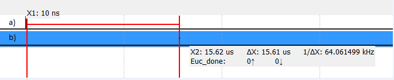

# High-Level Synthesis en FGPA Nexys-4DDR
----

<a href="https://img.shields.io/badge/License-undefined-brightgreen"></a>

## Tabla de contenidos
- [Descripción](#descripción) 
- [Requisitos](#requisitos)
- [Instalación y utilización](#instalación-y-utilización)
- [Selección de pragmas](#selección-de-pragmas)
- [Resultados obtenidos](#resultados-obtenidos)
    - [Vitis HLS](#vitis-hls)
    - [Resultados Simulación](#resultados-simulación)
    - [Resultado Exportación bloque IP](#resultado-exportación-bloque-ip)
    - [Implementación en Vivado](#implementación-en-vivado)  
    - [Latencia](#latencia)      
- [Contribución](#contribución)
- [Información de contacto](#información-de-contacto)

&emsp;

#

&emsp;

## Descripción

&emsp;

Este repositorio contiene los códigos fuentes para la implementación del cálculo de la distancia Euclidiana en la tarjeta de desarrollo Nexys DDR4 correspondiente a la
tarea 4 de la asignatura "Diseño Avanzado de Sistemas Digitales" (IPD432). Para lograr el objetivo propuesto se emplea la herramienta  High-Level-Synthesis (HLS) para implementar mediante el lenguaje  C/C++ la operación. Esto es posible mediante el uso de pragmas (indicadores de implementación a hardware), y mediante Vitis HLS se genera un bloque IP en RTL para importar en Vivado e instanciar el mismo empleando el lenguaje Verilog/Systemverilog. El siguiente desarrollo se basa en una estrategia de segmentación (pipeline), lo cual permite reducir el uso de recursos a cambio de una menor frecuencia máxima de reloj. Esta implementación tiene como objetivo integrar todas las operaciones dentro de la FPGA (suma, promedio, distancia de Manhattan y distancia Euclidiana).

&emsp;

El formato de este *readme* fue realizado mediante la ayuda del generador escrito por *Kfields91*, presente en el repositorio que se encuentra [aquí](https://github.com/Kfields91/README-Generator).

#

## Requisitos

&emsp;

Para ejecutar el código presente en este repositorio, se requiere previamente instalar los siguientes programas:

&emsp;
- Vitis HLS (Opcional): Herramienta que compila el código de alto nivel y lo exporta a un bloque IP para usar en Vivado. Si bien no es un requisito tenerlo instalado, ya que el repositorio posee el archivo exportado por Vitis HLS, es recomendable si se busca verificar el funcionamiento o en su defecto entender de mejor manera el código.
&emsp;
- Vivado: Herramienta para realizar la síntesis e implementación de los códigos escritos en lenguaje *SystemVerilog* a la tarjeta FPGA a utilizar.
&emsp;
- MATLAB: Herramienta utilizada para la implementación de la interfaz que establece la comunicación UART con la tarjeta, lo cual incluye envío y recibo de datos, a la vez de ejecutar las operaciones vectoriales. Es necesario instalar la versión R2019b o superior. No se garantiza el funcionamiento en versiones más antiguas.

&emsp;

La versión de Vitis HLS y Vivado utilizada para la verificación y resultados presente corresponde al *build* 2021.1. No se garantiza el correcto funcionamiento en versiones más recientes o antiguas.

&emsp;

Para la medición de latencia de la operación euclidiana, se requiere utilizar un Analizador lógico externo, dado que no existen recursos suficientes para uno interno (ILA), y de que es mejor tener un dispositivo con mayor frecuencia de muestreo.

&emsp;

IMPORTANTE: Es posible que hasta la fecha Vitis HLS tenga problemas para exportar a Bloque IP debido a un problema denominado "*New Year's bug*". Para solucionarlo, se deben seguir los pasos estipulados en el siguiente [link](https://support.xilinx.com/s/article/76960?language=en_US).
&emsp;

# 
&emsp;

## Instalación y utilización
&emsp;

1. Clonar el repositorio a un directorio de su elección. Se puede realizar, por ejemplo, con el siguiente comando en terminal linux (Se requiere tener acceso al repositorio, de lo contrario fallará la clonación):

```
git clone https://github.com/Joptis/Tarea4_parte1
```

2. Crear un proyecto de vivado desde 0. La forma típica es al iniciar el programa, dar clic en Create Project.

&emsp;

<center></center>
      <center>Pantalla de inicio, creación de proyecto</center>

&emsp;

En general se siguen los pasos por defecto para crear el proyecto. Es importante seleccionar la parte correcta correspondiente a la tarjeta *Nexys4 DDR*, la cual corresponde a *xc7a100tcsg324-1*.

&emsp;
<center></center>
      <center>Selección de chip (Default Part)</center>

&emsp;

3. Indicar el directorio de la ubicación del archivo .zip que contiene el bloque IP. Para ello, una vez abierto IP Catalog, clic derecho dentro de la interfaz y seleccionar "Add Repository".

<center></center>
      <center>Pestaña para añadir repositorio</center>

&emsp;

4. Añadir todos los archivos fuentes al proyecto de Vivado, los cuales se encuentra dentro del directorio "IP_block_test" del mismo repositorio. Project Manager->Add Sources->Add or Create design sources. Repetir lo mismo para el archivo de constrain, seleccionando "*Add or create constraints*".

5. En la pestaña de *Flow Navigator*, dar clic a *Generate Bitstream*. Esto lleva a cabo la generación del archivo de configuración *.bit* de la tarjeta. También se lleva a cabo la síntesis e implementación del código de SystemVerilog en caso que no se haya realizado previamente o se encuentren desactualizadas. 

6. Una vez generado el *Bitstream*, en la pestaña saliente, seleccione la opción *Open Hardware Manager*. Establezca la conexión con la FPGA haciendo clic en la opción *Auto Connect*, luego *Program Device*. El hardware descrito por él se encuentra compilado en la tarjeta.

7. Abrir MATLAB y correr el código de nombre *coprocessorTesting_Oficial.m*. Recuerde asignar la ubicación de todos los archivos .m en el PATH del programa. MATLAB avisa al usuario sobre ello la primera vez que se ejecuta un script. En la pestaña saliente seleccionar *Add to Path*.	

&emsp;

Cabe destacar que el bloque IP ya viene en el repositorio, por lo que no se requiere utilizar el Vitis HLS. En caso de querer comprobar los resultados presentes, se deben realizar los siguientes pasos:

&emsp;
1. Crear un nuevo proyecto de Vitis HLS. Dentro de la pestaña al iniciar el programa, dar clic en "Create Project".

&emsp;

2. Se entrará a una pestaña para agregar los *Design Files*. Dar clic en *Add Files*, y añadir todo archivo .cpp y .h, con excepción del archivo "EucTB.cpp", ya que es un archivo de simulación.

&emsp;

1. En la siguiente pestaña para agregar *testbenches*, realizar el procedimiento anterior, pero esta vez al archivo  restante (EucTB.cpp).

&emsp;

4. En la siguiente pestaña, se mantienen la gran mayoría de opciones por defecto, con la excepción del *Part Selection*, la cual debe coincidir con la usada en Vivado. Dar clic en *Finish*.

&emsp;

#

&emsp;
## Selección de pragmas

&emsp;
- ARRAY PARTITION: Este pragma permite realizar particiones de vectores en secciones más pequeñas. EL desarrollo de la tarea 3 considera una memoria de carácter SIPO (*Singular Input Parallel Output*), por lo que, al querer evitar realizar cambios en la arquitectura se decide realizar una partición completa a los 2 vectores, para así lograr una implementación idéntica.

&emsp;

- PIPELINE: Este pragma permite segmentar las operaciones realizadas en el código de alto nivel. Se utiliza este pragma para lograr una implementación con la menor cantidad de recursos posible, a cambio de una mayor latencia. Se realizan pruebas preliminares con el pragma UNROLL, la cual reduce el número de comparaciones a realizar, entregando una mejora considerable en la latencia. No obstante, la FPGA usada no posee los recursos necesarios para implementar dicha estrategia. Se utilizan los parámetros por defecto.

&emsp;
#
&emsp;

## Resultados obtenidos

&emsp;

### Vitis HLS

Para validar el código/diseño realizado en Vitis HLS, se debe seguir el siguiente flujo de verificación:

&emsp;

**C-Simulation ⇾ Synthesis ⇾ Export RTL**

&emsp;

La cosimulación no es considerada para el número de datos solicitado, debido a que el programa entrega falla (salida en FAIL) a pesar de estar funcionando correctamente en la FPGA, incluso para un menor número de datos. Se desconoce la razón de este falso positivo.

&emsp;
 
### Resultados simulación

&emsp;

Esta etapa realiza la ejecución del código presente en *EucSW.cpp* y *EucHW.cpp* y compara sus salidas con base en el *testbench* presente en *EucTB.cpp*, realizando repeticiones de la prueba una determinada cantidad de veces en función del valor dado a la variable *tests*. Un valor de retorno 0 indica una simulación exitosa. Al hacer clic en *C simulation* con las opciones por defecto, se obtiene el siguiente resultado en la terminal.

&emsp;


```
Number of errors: 0
INFO: [SIM 211-1] CSim done with 0 errors.
INFO: [SIM 211-3] *************** CSIM finish ***************
INFO: [HLS 200-111] Finished Command csim_design CPU user time: 6 seconds. CPU system time: 0 seconds. Elapsed time: 6.53 seconds; current allocated memory: 117.766 MB.
Finished C simulation.
```
&emsp;

No se presentan errores en las operaciones, al recibir el valor 0 como retorno de la simulación. Además se detalla el tiempo y recursos de la CPU para realizar la simulación. El número de pruebas realizado fueron un total de 100.

&emsp;

### Resultado síntesis

&emsp;

Se lleva a cabo el proceso de síntesis para determinar la interfaz (puertos de entrada salida, forma de implementación, entre otros) y reinterpretar la funcionalidad del código C en uno de hardware. La terminal entrega la siguiente información una vez terminado este proceso:

&emsp;

```
INFO: [VHDL 208-304] Generating VHDL RTL for EucHW.
INFO: [VLOG 209-307] Generating Verilog RTL for EucHW.
INFO: [HLS 200-790] **** Loop Constraint Status: All loop constraints were satisfied.
INFO: [HLS 200-789] **** Estimated Fmax: 140.95 MHz
INFO: [HLS 200-111] Finished Command csynth_design CPU user time: 872 seconds. CPU system time: 6 seconds. Elapsed time: 1084.14 seconds; current allocated memory: 607.312 MB.
INFO: [HLS 200-112] Total CPU user time: 874 seconds. Total CPU system time: 7 seconds. Total elapsed time: 1086.05 seconds; peak allocated memory: 1008.943 MB.
Finished C synthesis.
```

&emsp;

La síntesis determina que el bucle presente cumple con los requisitos de diseño. Además, se reporta los recursos que la CPU utilizó en total para realizar la operación y la frecuencia máxima de reloj en que el bloque puede teóricamente funcionar, aunque dicha estimación no considera conexiones con otros módulos.

&emsp;

También existe otro reporte que el programa entrega, referente a las estimaciones de rendimiento (latencia) y recursos al usar e implementar el bloque IP a generar. La información de importancia se presenta a continuación:

&emsp;

| Módulo & Bucles | Latencia (Ciclos) | Latencia (ns) | Pipelined | DSP | FF  | LUT  |
|------------------|-------------------|---------------|-----------|-----|-----|------|
| EucHW            | 1093              | 10930         | no        | 3   | 569 | 6965 |
| loop             | 1027              | 10270         | yes       | -   | -   | -    |

&emsp;

### Resultado Exportación bloque IP

&emsp;

Haciendo clic en Export RTL, permite generar el bloque IP a utilizar en el bloque Vivado. Debe asegurarse de tener el formato de exportación como Vivado IP. El nombre no es algo necesario de mantener, pero evita problemas con duplicados. La pestaña previa debe quedar de forma similar a la siguiente imagen:

&emsp;

<center></center>
      <center>Pestaña de exportación a bloque IP (*Output Location*)</center>

&emsp;

Una vez terminada, la terminal entrega lo siguiente:

&emsp;

```
INFO: [Common 17-206] Exiting Vivado at Tue Mar 22 15:39:15 2022...
INFO: [HLS 200-802] Generated output file Euc_res.zip
INFO: [HLS 200-111] Finished Command export_design CPU user time: 345 seconds. CPU system time: 5 seconds. Elapsed time: 881.63 seconds; current allocated memory: 211.783 MB.
Finished Export RTL/Implementation.
```
&emsp;

Similar a los puntos anteriores, se reporta el tiempo requerido y los recursos usados por la CPU para realizar la operación.

&emsp;

### Implementación en Vivado

&emsp;

Una vez realizada la integración del bloque euclidiano con el resto del *Processing Core*, la implementación entrega el siguiente reporte de recursos:


| Recurso | N.º en Uso | \%Uso |
|------------------------------|-------|-------|
| Slice LUTs                   | 53467 | 84.33 |
| LUT as Logic                 | 53411 | 84.24 |
| LUT as Memory                | 56    | 0.29  |
| Slice Registers              | 30895 | 24.37 |
| Register as Flip Flop        | 30895 | 24.37 |
| F7 Muxes                     | 4232  | 13.35 |
| F8 Muxes                     | 2048  | 12.92 |
| DSP                          | 3     | 1.25  |

&emsp;

Este reporte considera todos los módulos del *Processing Core* en total. Para el caso particular del bloque IP, se tiene el siguiente reporte de recursos:

&emsp;

| Recurso    | N.º en Uso |
|------------|-----------|
| Slice LUTs | 36990     |
| Flip Flops | 3978      |
| DSP        | 3         |

&emsp;

Este reporte en particular aparece siempre que no se tengan en caché la síntesis previa del mismo bloque IP. Para borrar esta caché se va a *Project Settings*, y dentro de la sección IP⇾IP Cache, hacer clic en *Clear Cache*.

&emsp;

Con respecto al tiempo requerido para realizar proceso de síntesis e implementación, el programa tarda 09:22 y 25:16, respectivamente en cada una. Esto se observa en la pestaña de *Design Runs*, la cual se accede por defecto, o mediante el buscador *Quick Access*. Estos tiempos difieren si se tiene un computador de alta gama o no se tiene muchos procesos abiertos en segundo plano.
&emsp;

<center></center>
      <center>Selección de chip (Default Part)</center>

&emsp;

| WNS (Worst Negative Slack) | TNS (Total Negative Slack) | WHS (Worst Hold Stack) |
|----------------------------|----------------------------|------------------------|
| 0.129                      | 0.0                        | 0.009                  |

&emsp;

### Latencia

&emsp;

Para medir la latencia se utilizan los 2 pines habilitados para medir la latencia del cálculo de la operación Euclidiana; sus ubicaciones se pueden apreciar en el archivo de *constraint*, correspondiente al archivo con extensión .xdr. El procedimiento de medición consiste en determinar el tiempo en que ocurre el canto de subida de la señal *ap\_start*, ligada a la señal *etrigger* del *decoder*, y el canto de subida de la señal ap\_done. Esta medición se realiza mediante el uso del Analizador Lógico presente en el Analog Discovery, ya que posee la suficiente frecuencia de muestreo para medir las señales a la frecuencia máxima obtenida.

&emsp;

Se determina que el intervalo de tiempo entre ambos cantos de subida es de aproximadamente 15.61 us. Considerando una frecuencia de reloj de 70 MHz, la cual fue usada en el experimento. La cantidad de ciclos que tarda la distancia Euclidiana en calcularse está dado por la siguiente ecuación:

&emsp;

<center></center>
      <center>Cálculo de ciclos de latencia</center>


&emsp;


Se obtiene que el cálculo tarda alrededor de 1092 ciclos en obtener la distancia euclidiana, lo cual se acerca a lo estimado por la tabla presente en la sección ["Resultado síntesis"](#resultado-síntesis).

&emsp;

<center></center>
      <center>Medición de latencia (Analog Discovery)</center>

&emsp;
#
&emsp;

## Contribución
En caso de querer aportar a los códigos presentes en este repositorio o tener dudas con respecto a resultados y contenido del mismo, puede enviar un mail al correo presente en la sección de ["Información de Contacto"](#información-de-contacto).

&emsp;
#
&emsp;

## Información de contacto

&emsp;

[Perfil del dueño del repositorio](https://github.com/Joptis)

&emsp;

[Correo del dueño del repositorio](jose.cayo.14@sansano.usm.cl)

