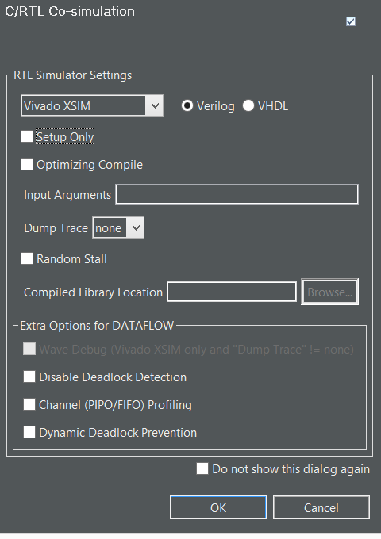

# High-Level Synthesis en FGPA Nexys-4DDR
----

<a href="https://img.shields.io/badge/License-undefined-brightgreen"></a>

## Tabla de contenidos
- [# High-Level Synthesis en FGPA Nexys-4DDR](#-high-level-synthesis-en-fgpa-nexys-4ddr)
- [Tabla de contenidos](#tabla-de-contenidos)
  - [Descripción](#descripción)
  - [Requisitos](#requisitos)
  - [Instalación y utilización](#instalación-y-utilización)
  - [Contribución](#contribución)
  - [Selección de pragmas](#selección-de-pragmas)
  - [Resultados obtenidos](#resultados-obtenidos)
  - [Contribución](#contribución-1)
  - [Informacion de contacto](#informacion-de-contacto)

### Descripción
Este repositorio contiene los códigos fuentes para la implementación de lo solicitado en la primera parte de la 
tarea 4 a desarrollar en el ramo IPD432 (Diseño avazanzado de sistemas digitales).	Este consiste en implementar el cálculo de la distancia Euclidiana utilizando estrategias de High-Level-Synthesis (HLS), el cual consiste definir una función en C que realiza una determinada operación, la cual mediante el uso de pragmas, los cuales establecen indicaciones de implementación a hardware, permiten generar un bloque IP para su uso en códigos de Verilog/Systemverilog. El desarrollo presente toma como base una implementación previa que sigue la estrategia e segmentacion (pipeline), lo cual permite reducir el uso de recursos a cambio de un menor reloj. La implementación de la distancia Euclidiana considera este paradigma, buscando integrar todas las operaciones dentro de la FPGA.

El formato de este readme fue realizado mediante la ayuda del generador escrito por Kfields91, presente en el repositorio que se encuentra [aquí].(https://github.com/Kfields91/README-Generator)

### Requisitos

Para ejecutar el código presente en este repositorio, se requiere previamente instalar los siguientes programas:

- Vitis HLS (Opcional): Herramienta que compila el código de alto nivel y lo exporta a un bloque IP para su uso en Vivado. Si bien no es un requisito tenerlo instalado, ya que el repositorio posee el archivo exportado por Vitis HLS, es recomendable si se busca verificar el funcionamiento o en su defecto entender de mejor manera el código.

- Vivado: Herramienta para realizar la síntesis e implementación de los códigos escritos en lenguaje SystemVerilog a la tarjeta FPGA a utilizar.

- Matlab: Herramienta utilizada para la implementación de la interfaz que establece la comunicación UART con la tarjeta, lo cual incluye envio y recibo de datos, a la vez de ejecutar las operaciones vectoriales. Se requiere instalar la versión R2019b o superior. No se garantiza el funcionamiento en versiones más antiguas.

La versión utilizada para Vitis HLS y Vivado corresponde al build 2021.1.

IMPORTANTE: Es posible que hasta la fecha Vitis HLS tenga problemas para exportar a Bloque IP debido a un problema denominado "New Year's bug". Para solucionarlo, se deben seguir los pasos estipulados [aquí](https://support.xilinx.com/s/article/76960?language=en_US).

Para la medición de latencia de la operación euclidiana, se requiere utilizar un Analizador lógico externo, dado a que no existen recursos suficientes para uno interno (ILA), y de que es mejor tener un dispositivo con mayor frecuencia de muestro. Los resultados de latencia consideran una frecuencia de operacion de 10MHz.


### Instalación y utilización

1. Clonar el repositorio a un directorio de su elección. Se puede realizar, por ejemplo, con el siguiente comando en terminal linux (Se requiere tener acceso al repositorio, de lo contrario fallará la clonación):

```
git clone https://github.com/Joptis/Tarea4_parte1
```

2. Crear un projecto de vivado desde 0. La forma tipica es al iniciar el programa, dar clic en Create Project.

<center></center>
      <center>This is an image</center>

En general se siguen los pasos por defecto para crear el proyecto. Es importante que selecciones la parte correcta correspondiente a la tarjeta Nexys4 DDR, la cual corresponde a xc7a100tcsg324-1.

<center></center>
      <center>This is an image</center>

3. Indicar el directorio de la ubicación del archivo .zip que contiene el bloque IP. Para ello, una vez abierto IP Catalog, clic derecho dentro de la interfaz y seleccionar "Add Repository".

<center></center>
      <center>This is an image</center>

1. Añadir todos los archivos fuentes al proyecto de Vivado, los cuales se encuentra dentro del directorio "IP_block_test" del mismo repositorio. Project Manager->Add Sources->Add or Create design sources. Repetir lo mismo para el archivo de constrain, seleccionando "Add or create contraints".

2. En la pestaña de Flow Navigator, dar clic a Generate Bitstream. Esto realiza la síntesis y la implementación del código previamente, para generar el archivo de configuración.

3. Generado el bitstream, en la pestaña saliente, seleccione la opción Open Hardware Manager. Establezca la conexión con la FPGA con la opcion Auto Connect, luego Program Device. El codigo se encuentra compilado en la tarjeta.

4. Abrir MATLAB y correr el código de nombre "coprocessorTesting_Oficial.m". Recuerde asignar la ubicacion de todos los archivos .m en el PATH del programa. MATLAB avisa al usuario la primera vez que se ejecuta un script. En la pestaña saliente seleccione Add to Path.	

Cabe destacar que el bloque IP ya viene en el repositorio, por lo que no se requiere utilizar el Vitis HLS. En caso de querer comprobar resultados, se deben realizar los siguentes pasos:

1. Crear un nuevo proyecto de Vitis HLS. Dentro de la pestaña al iniciar el programa, dar clic en "Create Project"
2. Se entrará a una pestaña para agregar los Design Files. Dar clic en Add Files, y añadir todo archivo .cpp y .h, con excepcion del archivo "EucTB.cpp" ya que es un archivo de simulación
3. En la siguiente pestaña para agregar testbenches, agregar el archivo faltante (EucTB.cpp)
4. En la siguiente pestaña, se mantienen la gran mayoría de opciones por defecto, con la excepción del Part Selection, la cual debe coincidir con la usada en Vivado. Dar clic en finalizar


<center></center>
      <center>This is an image</center>

### Contribución
Si buscas contribuir al repositorio o para realizar consultas del codigo

### Selección de pragmas
- ARRAY PARTITION: Este pragma permite particionar vectores en secciones más pequeñas. EL desarrollo de la tarea 3 considera una memoria de caracter SIPO (Singular input Parallel Output), por lo que, al querer evitar realizar cambios en la arquitectura se decide particionar los 2 vectores de forma completa, y asi lograr una implementación idéntica.

- PIPELINE: Este pragma permite segmentar las operacion realizada en el código de alto nivel. Se utiliza este pragma para lograr una implementacion con la menor cantidad de recursos posible, a cambio de una mayor latencia. Se realizan pruebas preliminares con el pragma UNROLL, que reduce la cantidad de comparaciones, y en contraste, una mejora considerable en la latencia. No obstante, la FPGA usada no posee los recursos necesarios para implementar dicha estrategia. Se utilizan los parámetros por defecto.
### Resultados obtenidos

1. Vitis HLS

Para validar el diseño realizado en vitis HLS, se debe seguir el siguiente flujo de verificación.

C Simulation -> Synthesis -> Export RTL

La cosimulacion no es considerada para el número de datos solicitado, debido a que el programa entregaba falla a pesar de estar funcionando correctamente en la FPGA, tanto para un menor número de datos. Se desconoce la razón de este falso positivo.

- Resultados simulación

Esta etapa realiza la ejecución del código presente en EUCSW.cpp y EucHW.cpp y los compara, repitiendo la prueba una determinada cantidad de veces. Un valor de retorno 0 indica simulación exitosa. Al dar clic en C simulation, con las opciones por defecto. Se obtiene el siguiente resultado en la terminal.
```

Number of errors: 0
INFO: [SIM 211-1] CSim done with 0 errors.
INFO: [SIM 211-3] *************** CSIM finish ***************
INFO: [HLS 200-111] Finished Command csim_design CPU user time: 6 seconds. CPU system time: 0 seconds. Elapsed time: 6.53 seconds; current allocated memory: 117.766 MB.
Finished C simulation.
```
No se presenta errores en las operaciones, al recibir el valor 0 como retorno de la simulación. Además se detalla el tiempo y recursos de la CPU para realizar la simulación.

- Resultado síntesis

Esto lleva a cabo la simulación para determinar la interfaz (puertos de entrada salida, forma de implementación, entre otros) y reinterpretar la funcionalidad del código C en uno de hardware. La terminal entrega la siguiente información, con respecto al proceso de sintetización:
```
INFO: [VHDL 208-304] Generating VHDL RTL for EucHW.
INFO: [VLOG 209-307] Generating Verilog RTL for EucHW.
INFO: [HLS 200-790] **** Loop Constraint Status: All loop constraints were satisfied.
INFO: [HLS 200-789] **** Estimated Fmax: 140.95 MHz
INFO: [HLS 200-111] Finished Command csynth_design CPU user time: 872 seconds. CPU system time: 6 seconds. Elapsed time: 1084.14 seconds; current allocated memory: 607.312 MB.
INFO: [HLS 200-112] Total CPU user time: 874 seconds. Total CPU system time: 7 seconds. Total elapsed time: 1086.05 seconds; peak allocated memory: 1008.943 MB.
Finished C synthesis.
```
La sintesis determina que el bucle presente cumple con los requisitos de diseño. Además se reporta los recursos que la CPU utilizó en total para realizar la operación, la frecuencia máxima de reloj en que el bloque puede teóricamente funcionar.

Tambies existe otro reporte que el programa entrega, referente a las estimaciones de rendimiento (latencia) y recursos al usar e implementar el bloque IP a generar. La información de importancia se presenta a continuación:

| Módulo && Bucles | Latencia (Ciclos) | Latencia (ns) | Pipelined | DSP | FF  | LUT  |
|------------------|-------------------|---------------|-----------|-----|-----|------|
| EucHW            | 1093              | 10930         | no        | 3   | 569 | 6965 |
| loop             | 1027              | 10270         | yes       | -   | -   | -    |


- Resultado Exportación bloque IP

Haciendo clic en Export RTL, permite generar el IP a utilizar en el bloque vivado. Debe asegurarse de tener el formato de exportación como Vivado IP. El nombre no es algo necesario de mantener, pero evita problemas con duplicados. La pestaña previa debe quedar de forma similar a la imagen:

<center></center>
      <center>This is an image</center>

Una vez terminada, la terminal entrega lo siguiente:
```
INFO: [Common 17-206] Exiting Vivado at Tue Mar 22 15:39:15 2022...
INFO: [HLS 200-802] Generated output file Euc_res.zip
INFO: [HLS 200-111] Finished Command export_design CPU user time: 345 seconds. CPU system time: 5 seconds. Elapsed time: 881.63 seconds; current allocated memory: 211.783 MB.
Finished Export RTL/Implementation.
```

Similar a los puntos anteriores, se reporta el tiempo requerido y los recursos usado por la CPU para realizar la operación.

2. Vivado

Al realizar la integración del bloque euclidiano con el resto del Processing Core, la implementación entrega el siguiente reporte de recursos:

| Recurso | N° en Uso | \%Uso |
|------------------------------|-------|-------|
| Slice LUTs                   | 53467 | 84.33 |
| LUT as Logic                 | 53411 | 84.24 |
| LUT as Memory                | 56    | 0.29  |
| Slice Registers              | 30895 | 24.37 |
| Register as Flip Flop        | 30895 | 24.37 |
| F7 Muxes                     | 4232  | 13.35 |
| F8 Muxes                     | 2048  | 12.92 |
| DSP                          | 3     | 1.25  |

Este reporte considera todos los módulos del Processing core en total. Para el caso particular del bloque IP, se tiene el siguiente reporte de recursos:

| Recurso    | N° en Uso |
|------------|-----------|
| Slice LUTs | 36990     |
| Flip Flops | 3978      |
| DSP        | 3         |


Con respecto al tiempo requerido para realizar proceso de síntesis e implementación, el programa tarda 09:22 y 25:16, respectivamente en cada una. Esto se observa en la pestaña de Design Runs, la cual se accede por defecto, o mediante el buscador Quick Access. Estos tiempos difieren si se tiene un computador de alta gama y si no tiene muchos procesos abiertos.
<center></center>
      <center>This is an image</center>


### Contribución
Si buscas contribuir al repositorio o para realizar consultas del codigo


### Informacion de contacto
[Github Profile](https://github.com/Joptis)
           jose.cayo.14@sansano.usm.cl

